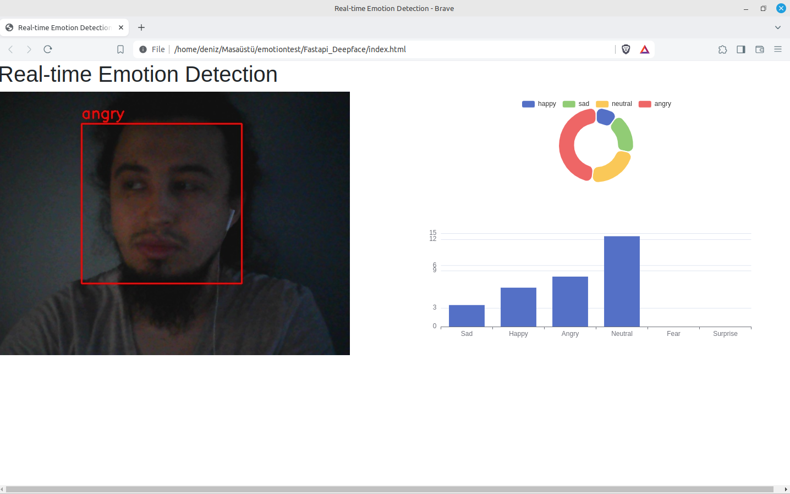

# Realtime emotion detection service
Built with FastApi,DeepFace,echarts   

Its answer for "how to entegrated haarcascade model to ui"

## usage
If you  type with an order ,you will get output like mine.
```
virtualenv venv
```
```
source venv/bin/activate
```

```
(venv)... $  pip install -r requirements.txt
```

```
uvicorn main:app --reload
```

## Output
You will see output like that 




### Resources
1. https://docs.opencv.org/4.x/dd/d43/tutorial_py_video_display.html
2. https://www.geeksforgeeks.org/python-opencv-capture-video-from-camera/
3. https://www.geeksforgeeks.org/facial-expression-detection-using-deepface-module-in-python/
4. https://pyimagesearch.com/2019/09/02/opencv-stream-video-to-web-browser-html-page/#download-the-code
5. https://github.com/tien02/face_recognition_api/blob/main/app/config.py
